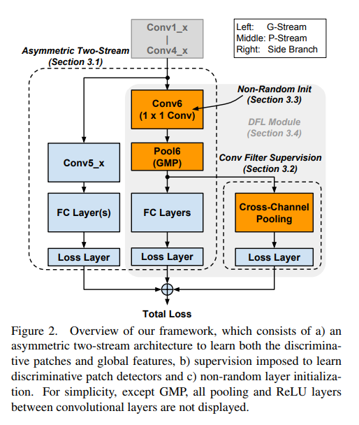

# DFL-CNN-tensorflow

Implementation of the CVPR2018 [Learning a Discriminative Filter Bank within a CNN for Fine-grained Recognition](https://arxiv.org/abs/1611.09932) in Tensorflow. 

## Abstract

Compared to earlier multistage frameworks using CNN features, recent end-to-end deep approaches for fine-grained recognition essentially enhance the mid-level learning capability of CNNs. Previous approaches achieve this by introducing an auxiliary network to infuse localization information into the main classification network, or a sophisticated feature encoding method to capture higher order feature statistics. We show that mid-level representation learning can be enhanced within the CNN framework, by learning a bank of convolutional filters that capture class-specific discriminative patches without extra part or bounding box annotations. Such a filter bank is well structured, properly initialized and discriminatively learned through a novel asymmetric multi-stream architecture with convolutional filter supervision and a non-random layer initialization. Experimental results show that our approach achieves state-of-the-art on three publicly available fine-grained recognition datasets (CUB-200-2011, Stanford Cars and FGVC-Aircraft). Ablation studies and visualizations are provided to understand our approach.

## Framwork

## Requirements

First install tensorflow, then install other Python packages:
  >pip install -r requirements.txt
  
## Usage

>python dfb_train.py
 
## Reference

- [Learning a Discriminative Filter Bank within a CNN for Fine-grained Recognition](https://arxiv.org/abs/1611.09932)

## TODO

- [ ] Nonrandomly initialization